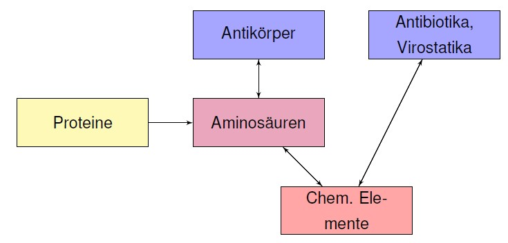

Spielanleitung
==============

Nach dem Starten von *Microverse* erscheint das Hauptmenü. Um das Spiel zu starten *Start Game* drücken.
Das Spiel ist in Events gegliedert, die zufällig starten. In jedem Event müssen Ziele erreicht werden, die beim Start des Events beschrieben sind.

Steuerung
---------
Der Nanobot kann mit den Tasten *A, S, D, F* gesteuert werden. Eine Liste aller Aktionen ist hier aufgeführt:

================   ===========================
Taste              Effekt
----------------   ---------------------------
Maus bewegen       Kamera bewegen
W                  Nanobot nach vorne bewegen
A                  Nanobot nach links bewegen
S                  Nanobot nach hinten bewegen
D                  Nanobot nach rechts bewegen
F                  Virus / Bakterium aufnehmen
Tab                Gegenmittel wechseln
U                  Antikörper aussenden
I                  Inventar öffnen / schliessen
ESC                Spiel pausieren / fortsetzen
Linke Maustaste    Laser feuern
Rechte Maustaste   Kontextmenü im Inventar
================   ===========================

Gegenmittel
-----------
Um Gegenmittel zu entwickeln müssen zwei Voraussetzungen erfüllt sein:

- Es müssen entsprechende Viren / Bakterien erforscht werden. Dazu muss das Pathogen zunächst mit *F* aufgenommen worden sein
- Es müssen genügend Rohstoffe gesammelt worden sein. Rohstoffe werden in der Form von Proteinen von zerstörten Viren und Bakterien abgegeben (siehe :ref:`Crafting`)

Crafting
--------

Rohstoffe können in primitivere oder höhere Rohstoffe umgewandelt werden. Z.B. können Proteine in chemische Elemente umgewandelt werden und aus chemischen Elementen
können Antibiotika hergestellt werden. Es gelten folgende Regeln:

Um Rohstoffe in primitivere Rohstoffe zu verwandeln, können diese im Inventar mit der rechten Maustaste angeklickt und anschliessend umgewandelt werden.

Spielende (Game Over)
---------------------

Das Spiel wird unter drei Umstände beendet:

1. Alle Events sind abgeschlossen
2. Ein einzelnes Körperteil weist zu viele Infektionen auf (auf der Übersicht dargestellt)
3. Es befinden sich zu viele Bakterien im Körper
